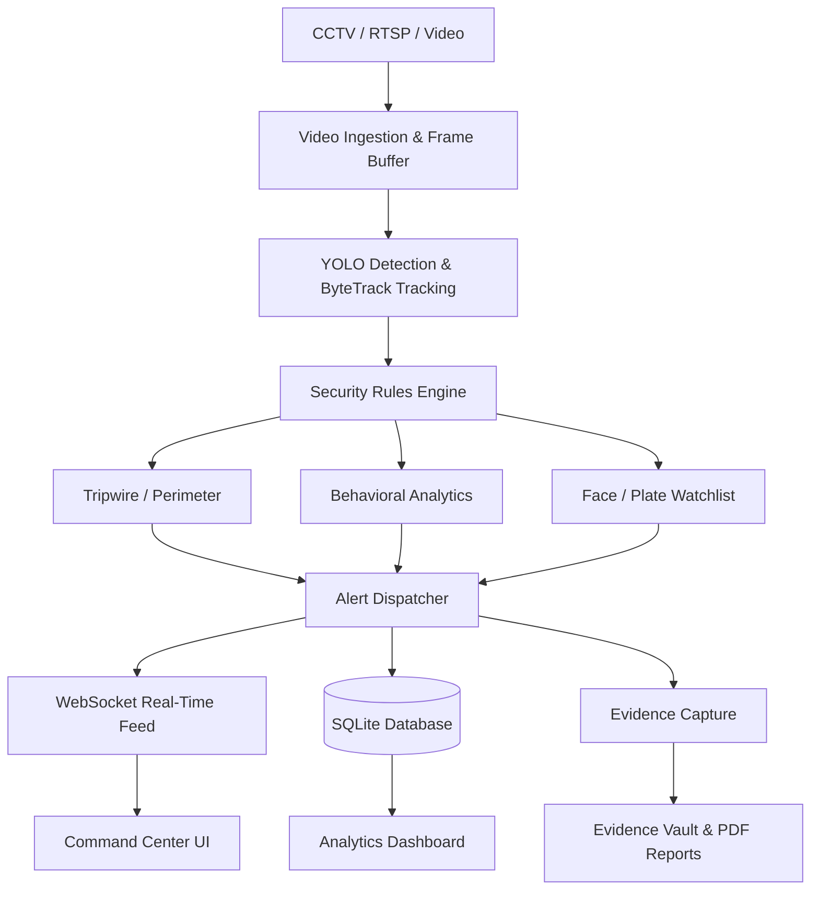

# DRISHTI

**AI Safety Monitoring for Schools, Shops, Streets, Homes and Factories**

DRISHTI is a real-time edge AI safety platform that turns the CCTV you already own into an active early-warning system. Instead of footage you review after something has gone wrong, it watches live and raises the alarm as it happens — a fight breaking out, a fire starting, someone crossing a line they shouldn't, a crowd building. It runs on ordinary hardware and needs no proprietary cameras.

## Key Features

- **Real-Time CCTV Monitoring:** Seamlessly ingest RTSP, WebRTC, phone cameras, or local video feeds.
- **Fight Detection:** Flags physical altercations from sustained contact plus violent motion between two tracked people.
- **Fire & Smoke Detection:** Dual-band flame colour with in-mask flicker analysis; optional fire/smoke model weights.
- **Advanced Object Detection & Tracking:** High-speed, highly accurate detection of persons and vehicles using YOLO architecture and ByteTrack.
- **Virtual Tripwires (Multiple per Camera):** Draw multiple virtual boundaries directly on the live feed. Intrusions trigger immediate critical alerts with a configurable cooldown to prevent spam.
- **Watchlist & Face Recognition:** Upload target faces or suspect vehicle license plates. Matches are confirmed across multiple frames using DeepFace/RetinaFace before triggering alerts.
- **Behavioral Analytics:** Detect suspicious activities like prolonged dwelling and crowd gathering based on configurable spatial density thresholds.
- **Alert Center & C2 Webhooks:** Centralized, deduped alert feed categorized by severity. Integrated webhook support to instantly push events to external Command & Control systems.
- **Evidence Vault:** Every critical incident automatically captures a high-resolution snapshot at the exact moment of the violation.
- **Professional Incident Reports (PDF):** Download securely generated PDF reports containing incident metadata, geospatial camera data, embedded snapshots, and a SHA-256 cryptographic hash of the evidence.
- **Asynchronous Architecture:** Heavy ML inference (Face Recognition, ALPR) runs in background thread pools, ensuring video streams never lag or block during processing.

## System Architecture

DRISHTI is built on a decoupled, asynchronous microservices architecture.

- **Frontend:** React, Vite, Tailwind CSS, Recharts (Analytics), React-Leaflet (Geospatial mapping)
- **Backend:** Python, FastAPI, SQLAlchemy, SQLite, WebSockets
- **AI/ML Engine:** Ultralytics YOLOv8, ByteTrack, DeepFace (Face Recognition), OpenCV



## Installation & Setup

### Requirements
- Python 3.10+
- Node.js 18+
- npm (Node Package Manager)

### Backend Setup
```bash
cd backend
python -m venv venv

# Windows
venv\Scripts\activate
# Linux/Mac
source venv/bin/activate

# Install dependencies
pip install -r requirements.txt
pip install reportlab  # Required for PDF generation

# Start the Backend Server (FastAPI)
uvicorn app.main:app --host 0.0.0.0 --port 8000 --reload
```

### Frontend Setup
```bash
cd frontend

# Install dependencies
npm install

# Start the Frontend Development Server (Vite)
npm run dev
```

### Running the Application
Once both servers are running, open your browser and navigate to:
**http://localhost:5173**

## Environment Variables
The application primarily runs on sensible defaults for local development. However, you can configure Webhook integration in the Settings tab of the UI. No `.env` file is strictly required out of the box.

## User Guide

### Watchlist Setup
1. Navigate to **Watchlist Management**.
2. To add a person, click **Add Target Person**. Provide a name, description, and upload a clear, front-facing image.
3. The system will automatically compute and cache the facial embedding. 
4. To delete, simply click the trash icon on the person's card.

### Setting up Tripwires
1. Ensure the target camera is **Active**.
2. Navigate to **Camera Management** and click the **Gear Icon (Configure)** next to your camera.
3. Select **Tripwire**.
4. Click anywhere on the video frame to drop the first point, and click again to drop the second point. A red line will appear.
5. You can repeat this process to draw **multiple tripwires** on the same camera.
6. Click **Save Tripwires**.
*Note: Tripwires require a fixed, stationary camera. PTZ (Pan-Tilt-Zoom) movement will invalidate the coordinate mapping.*

### Exporting PDF Incident Reports
1. When a critical alert is triggered, navigate to the **Evidence Vault**.
2. Locate the incident card and hover over the image.
3. Click **PDF REPORT** to securely download the hashed incident document.

## API Overview

| Method | Endpoint | Purpose |
|--------|----------|---------|
| GET | `/api/cameras` | List all configured cameras |
| POST | `/api/cameras` | Register a new camera |
| PATCH | `/api/cameras/{id}/tripwire` | Save tripwire coordinate arrays |
| GET | `/api/events` | Retrieve paginated historical alerts |
| GET | `/api/events/{id}/evidence/download` | Download raw JPG evidence |
| GET | `/api/reports/{id}/download` | Generate and download PDF report |
| POST | `/api/watchlist/faces` | Upload face and generate embedding |
| DELETE | `/api/watchlist/faces/{id}` | Remove face from database |
| WS | `/ws/alerts` | Real-time WebSocket connection for UI |
| WS | `/ws/camera/{id}` | Real-time JPEG frame streaming |

## Security Considerations
- **Authentication:** The current implementation is an internal dashboard designed for a trusted local network or control room. API Authentication (JWT) is stubbed but disabled by default for hackathon demonstration purposes.
- **Evidence Integrity:** Every captured evidence frame is cryptographically hashed (SHA-256) at the time of report generation to ensure chain-of-custody validity for insurance, HR or law-enforcement follow-up.

## Known Limitations
- **PTZ Cameras:** Virtual tripwires currently do not compensate for Pan-Tilt-Zoom camera movement.
- **Compute Optimization:** While highly optimized for CPU using threaded workers, running >4 simultaneous high-res video streams with Face Recognition enabled is recommended on systems with a dedicated GPU (CUDA) and Intel OpenVINO.
- **Weapon/Drone Detection:** The base model classifies Persons and Vehicles. Detection of specific anomalies (drones, firearms) requires swapping the `yolov8s.pt` weights with a fine-tuned custom model (refer to `README_CUSTOM_MODEL.md`).

## Demonstration Workflow
1. **Initialize:** Open DRISHTI Command Center (Dashboard).
2. **Detection:** Demonstrate real-time bounding boxes around persons and vehicles.
3. **Tripwire:** Draw a multi-line boundary on a camera feed. Wait for a person to cross it to trigger a **Critical Alert**.
4. **Behavior:** Show how ordinary movement does not trigger alerts, but a person loitering/dwelling for a prolonged time triggers an **Alpha Priority** alert.
5. **Watchlist:** Add a known face to the watchlist. Show the system confirming the identity across 3 consecutive frames before alarming.
6. **Reporting:** Open the Evidence Vault, select the intrusion, and generate a **PDF Incident Report** to highlight the SHA-256 legal hash feature.
