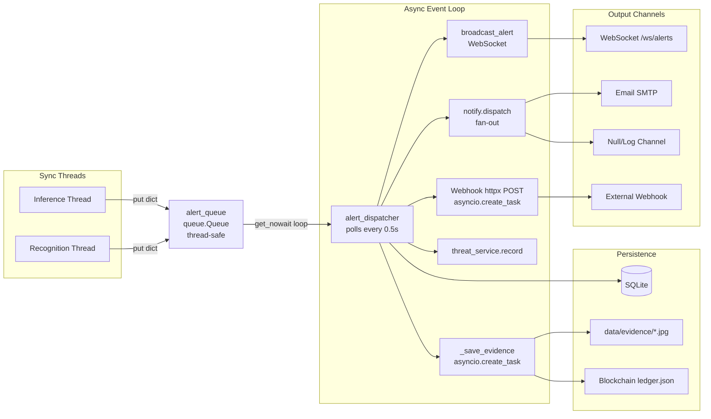

# DRISHTI — Alert Pipeline & Notification System

## Alert Pipeline Architecture

The alert pipeline is the central nervous system of DRISHTI. It bridges the synchronous ML inference threads to the asynchronous FastAPI event loop, persisting events, capturing evidence, and broadcasting to all output channels.



---

## Alert Dict Shape

Every alert placed on `alert_queue` is a dict with these fields:

| Field | Type | Source | Required |
|-------|------|--------|----------|
| `id` | string | Unique event ID (e.g., `"inc_1694358000_42"`) | Yes |
| `camera_id` | int | Camera that generated the alert | Yes |
| `type` | string | Event type (see table below) | Yes |
| `severity` | string | `"info"`, `"warning"`, `"high"`, `"critical"` | Yes |
| `level` | string | Display label (e.g., `"CRITICAL"`, `"PRIORITY ALPHA"`) | Yes |
| `title` | string | Short human-readable title | Yes |
| `detail` | string | Detailed description | Yes |
| `time` | string | `HH:MM:SS` formatted timestamp | Yes |
| `icon` | string | Emoji icon (e.g., `"🚨"`, `"🔥"`, `"👊"`) | Yes |
| `frame_data` | bytes | Raw OpenCV frame for evidence capture | Optional |

### Event Types

| `type` Value | Severity | Source | Description |
|--------------|----------|--------|-------------|
| `intrusion` | critical | Tripwire logic in `ml_inference.py` | Person or vehicle crossed a virtual tripwire |
| `dwelling` | warning | Behavior logic in `ml_inference.py` | Person detected for > `dwelling_time` seconds |
| `behavioral` | warning | Behavior logic in `ml_inference.py` | Fleeing subject or crowd gathering |
| `fight` | critical | `detectors/fight.py` | Two persons in sustained physical contact with motion |
| `fire` | critical | `detectors/fire.py` | Flame detected via structural analysis |
| `smoke` | high | `detectors/fire.py` | Smoke region detected (opt-in) |
| `crash` | critical | `detectors/crash.py` | Vehicle crash via deceleration or contact-then-stop |
| `watchlist_match` | critical | `recognition.py` | Face or license plate matched against watchlist |

---

## The `alert_dispatcher` Loop

Defined in: [`backend/app/main.py`](file:///c:/Users/Ekjot%20singh/Desktop/SIH_2026/backend/app/main.py)

This is an `async def` function launched as an `asyncio.create_task` during FastAPI lifespan startup. It runs indefinitely:

```python
async def alert_dispatcher():
    while True:
        events = []
        while not alert_queue.empty():
            try:
                events.append(alert_queue.get_nowait())
            except:
                break

        for alert in events:
            # 1. Extract frame_data (remove from dict before serialization)
            frame_data = alert.pop("frame_data", None)

            # 2. Insert Event row into SQLite
            db_event = Event(
                camera_id=alert["camera_id"],
                event_type=alert["type"],
                severity=alert["severity"],
                object_class=alert.get("object_class", "unknown"),
                details=json.dumps(alert),
                status="new"
            )
            db.add(db_event)
            db.commit()

            # 3. Look up Camera name for enrichment
            camera = db.query(Camera).filter(Camera.id == alert["camera_id"]).first()

            # 4. Save evidence and hash it
            if frame_data is not None:
                asyncio.create_task(_save_evidence(db_event.id, frame_data))

            # 5. Dispatch webhook if configured
            if webhook_url and alert["severity"] in ("warning", "high", "critical"):
                asyncio.create_task(_send_webhook(webhook_url, broadcast_data))

            # 6. Broadcast to WebSocket subscribers
            await broadcast_alert(broadcast_data)

            # 7. Record in threat score
            threat_service.record(broadcast_data)

            # 8. Fan out to notification channels
            notify.dispatch(broadcast_data)

        await asyncio.sleep(0.5)
```

### Evidence Saving (`_save_evidence`)

```python
async def _save_evidence(event_id, frame_data):
    # 1. Save JPEG to data/evidence/evt_{id}.jpg
    path = f"data/evidence/evt_{event_id}.jpg"
    cv2.imwrite(path, frame_data)

    # 2. Compute SHA-256 hash of the frame bytes
    _, jpeg_bytes = cv2.imencode(".jpg", frame_data)
    evidence_hash = hashlib.sha256(jpeg_bytes.tobytes()).hexdigest()
    event_hash = hashlib.sha256(json.dumps({...}).encode()).hexdigest()

    # 3. Submit to blockchain for mining
    blockchain_service.queue_transaction(event_id, evidence_hash, event_hash)

    # 4. Update database row with thumbnail path
    db_event.thumbnail_path = f"/evidence/evt_{event_id}.jpg"
    db.commit()
```

---

## Notification System

### Architecture

File: [`backend/app/services/notify/dispatcher.py`](file:///c:/Users/Ekjot%20singh/Desktop/SIH_2026/backend/app/services/notify/dispatcher.py)

The notification system mirrors the detector framework — a registration-based pattern where channels self-register via the `@register` decorator.

### Channel Base Class

```python
class Channel(ABC):
    name: str = "channel"              # Unique key
    default_enabled: bool = False
    default_min_severity: str = "critical"

    def is_enabled(settings) -> bool   # notify_{name}_enabled
    def min_severity(settings) -> str  # notify_{name}_min_severity
    def meets_threshold(event, settings) -> bool
    def send(event, settings)          # async or blocking
```

### Registered Channels

| Channel | Class | Enabled | Min Severity | Blocking? |
|---------|-------|---------|-------------|-----------|
| `null` | `NullChannel` | Yes | info | No (async) |
| `email` | `EmailChannel` | Yes | critical | Yes (daemon thread) |

### Dispatch Flow

```
dispatch(alert_dict):
  1. Check notify_enabled master switch
  2. Build NotificationEvent from alert dict
  3. For each registered channel:
     a. Check channel.is_enabled(settings)
     b. Check channel.meets_threshold(event, settings)
     c. If both pass:
        - asyncio.create_task(_run_channel)
        - For async channels: await with timeout
        - For blocking channels: run on dedicated daemon thread
  4. Return list of scheduled tasks (fire-and-forget)
```

### Blocking Channel Safety
- Blocking `send()` methods (like smtplib) run on **dedicated daemon threads**, NOT `asyncio.to_thread`
- Reason: `to_thread` shares a bounded executor; a hung SMTP would hold a pool slot forever
- Daemon threads that time out are simply abandoned (they can't block interpreter shutdown)
- `notify_max_blocking_threads` (default 16) caps zombie accumulation

### Timeout
- Every channel is wrapped in `asyncio.wait_for` with `notify_timeout` (default 10.0s)
- Timed-out channels are logged with full traceback but don't affect other channels

---

## Email Channel Detail

File: [`backend/app/services/notify/email.py`](file:///c:/Users/Ekjot%20singh/Desktop/SIH_2026/backend/app/services/notify/email.py)

### Configuration (Environment Variables)

| Variable | Required | Example |
|----------|----------|---------|
| `SMTP_HOST` | Yes | `smtp.gmail.com` |
| `SMTP_PORT` | No (default 587) | `587` |
| `SMTP_USER` | Yes | `you@gmail.com` |
| `SMTP_PASSWORD` | Yes | 16-char App Password |
| `SMTP_FROM` | No (defaults to SMTP_USER) | `DRISHTI <you@gmail.com>` |
| `SMTP_TO` | Yes | `commander@example.com,officer@example.com` |
| `SMTP_USE_TLS` | No (default true) | STARTTLS on 587 |
| `SMTP_USE_SSL` | No (default false) | Implicit TLS on 465 |

If any required variable is missing, the channel logs once and skips silently.

### Email Content

**Subject**: `[CRITICAL] Tripwire Intrusion: Person — Front Gate`

**HTML**: Professional incident card with:
- Severity-coloured header bar (red for critical, orange for high, etc.)
- `DRISHTI · Incident Alert` branding
- Event title with icon
- Detail text
- Metadata table (event type, severity, camera, timestamp, event ID)
- **Evidence frame inline** (attached as CID, not a URL, so it renders in offline email clients)
- Footer: "Automated message from the DRISHTI safety monitoring platform. Evidence is SHA-256 hashed at report generation for chain-of-custody."

**Plain text**: Fallback for clients that don't render HTML.

### Evidence Handling
The evidence JPEG is saved asynchronously — it may not exist when the email channel starts. The `wait_for_evidence()` function:
1. Polls for the file on a 100ms interval
2. Checks that the file ends with JPEG EOI marker (`0xFFD9`) to confirm it's fully written
3. Times out after `notify_email_evidence_wait` (default 3.0s)
4. If timeout: sends email without the image, with a warning banner

### Runtime Settings

| Setting | Default | Description |
|---------|---------|-------------|
| `notify_email_enabled` | true | Toggle email channel |
| `notify_email_min_severity` | critical | Min severity to send |
| `notify_email_evidence_wait` | 3.0s | How long to wait for evidence JPEG |
| `notify_email_smtp_timeout` | 20.0s | Socket timeout for SMTP |

---

## Webhook Integration

Defined inline in `alert_dispatcher()` in `main.py`:

```python
if webhook_url and alert["severity"] in ("warning", "high", "critical"):
    asyncio.create_task(_send_webhook(webhook_url, broadcast_data))
```

- Configured via `webhook_url` setting (modifiable in Settings UI)
- Only sends for `warning`, `high`, and `critical` severity
- Uses `httpx.AsyncClient.post()` with 10s timeout
- Fire-and-forget: failures are logged but don't affect other dispatch

---

## Threat Score System

File: [`backend/app/services/threat_score.py`](file:///c:/Users/Ekjot%20singh/Desktop/SIH_2026/backend/app/services/threat_score.py)

### Formula

```
score(t) = min(100, Σ weight × 0.5 ^ (age / half_life))
```

Exponential decay: contributions halve every `threat_half_life` seconds (default 120s). Score moves smoothly instead of stepping down when events leave a fixed window.

### Severity Weights

| Severity | Weight |
|----------|--------|
| critical | 40.0 |
| high | 25.0 |
| warning | 12.0 |
| info | 4.0 |

### Score Bands

| Threshold | Label | Colour |
|-----------|-------|--------|
| ≥ 75 | CRITICAL | `#dc2626` (red) |
| ≥ 50 | HIGH | `#ea580c` (orange) |
| ≥ 25 | ELEVATED | `#ca8a04` (yellow) |
| ≥ 0 | NOMINAL | `#16a34a` (green) |

### API Response (`GET /api/system/threat`)

```json
{
  "score": 42.5,
  "level": "ELEVATED",
  "color": "#ca8a04",
  "previous_score": 38.2,
  "trend": 4.3,
  "active_events": 5,
  "half_life": 120.0,
  "bands": [...],
  "contributors": [
    {"type": "intrusion", "title": "...", "contribution": 28.5, ...}
  ],
  "per_camera": {"1": 30.0, "3": 12.5},
  "updated_at": 1694358000.0
}
```

### Memory Management
- Max 500 retained events
- Events pruned after 8 half-lives (~0.4% remaining contribution)
- Thread-safe via `threading.Lock`

---

## Blockchain Evidence Integrity

File: [`backend/app/services/blockchain.py`](file:///c:/Users/Ekjot%20singh/Desktop/SIH_2026/backend/app/services/blockchain.py)

### Purpose
Provides tamper-evident storage of evidence hashes. Every critical event's evidence JPEG is SHA-256 hashed and recorded in a proof-of-work blockchain stored in `data/blockchain/ledger.json`.

### Block Structure
```json
{
  "index": 42,
  "timestamp": 1694358000.0,
  "event_id": 15,
  "evidence_hash": "a3f2...",     // SHA-256 of JPEG bytes
  "event_hash": "b4e1...",       // SHA-256 of event metadata
  "previous_hash": "c5d0...",
  "nonce": 1234,
  "hash": "000abc..."            // SHA-256 of block contents
}
```

### Mining
- **Difficulty**: 3 (hash must start with `"000"`)
- **Worker**: Dedicated daemon thread consuming from `mining_queue`
- **Non-blocking**: `queue_transaction()` returns immediately; mining happens in background
- **Persistence**: Chain saved to `ledger.json` after each block

### Chain Verification
```python
def verify_chain() -> bool:
    for i in range(1, len(chain)):
        current = chain[i]
        prev = chain[i - 1]
        if current.hash != current.calculate_hash():
            return False    # Block tampered
        if current.previous_hash != prev.hash:
            return False    # Chain broken
    return True
```
