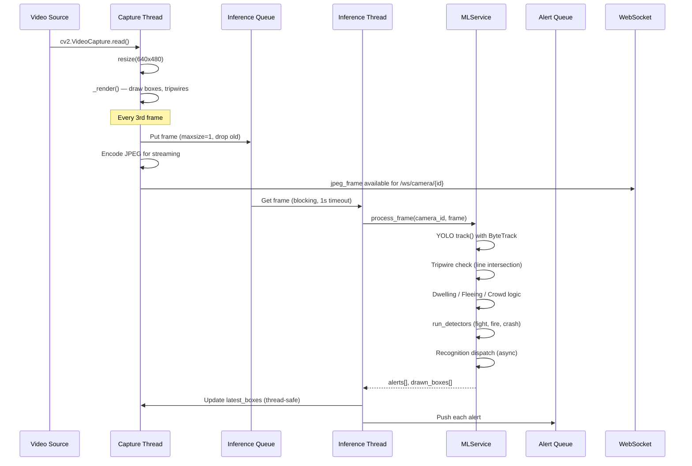
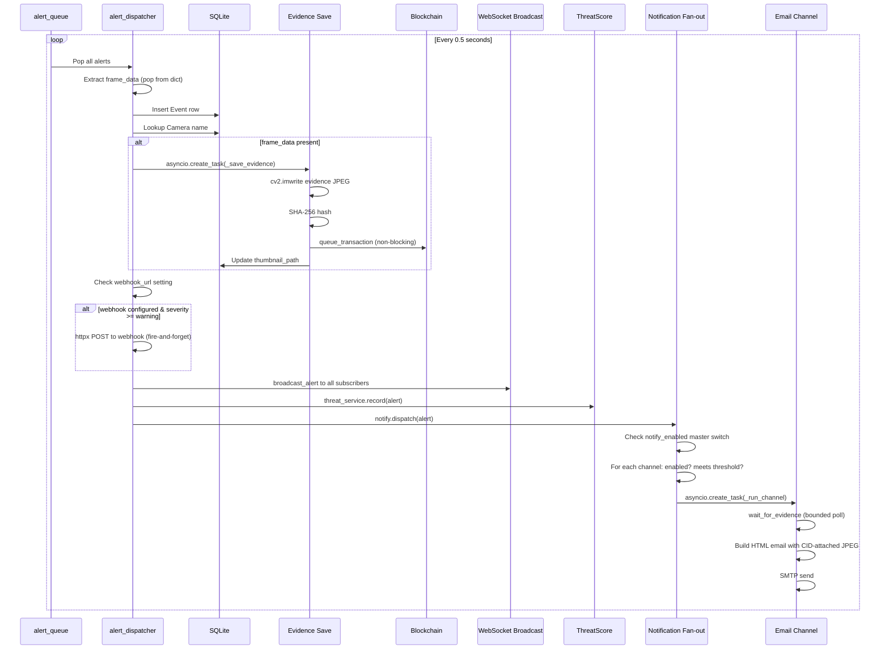

# DRISHTI — System Architecture

## High-Level Architecture

```mermaid
graph TD
    subgraph "Video Sources"
        CCTV[CCTV / RTSP Camera]
        FILE[Video File Upload]
        PHONE[Phone Camera WebSocket]
    end

    subgraph "Frontend — React/Vite"
        LANDING[Landing Page 3D Globe]
        DASH[Command Center Dashboard]
        CAM_UI[Camera Management UI]
        ALERT_UI[Alert Center]
        ANALYTICS[Analytics Dashboard]
        WATCH_UI[Watchlist Management]
        MAP[Geospatial Map View]
        VAULT[Evidence Vault]
        SETTINGS_UI[Settings Page]
        PHONE_UI[Phone Camera Page]
    end

    subgraph "Backend — FastAPI/Python"
        subgraph "API Layer"
            CAM_API[Camera API Router]
            EVT_API[Events API Router]
            WL_API[Watchlist API Router]
            RPT_API[Reports API Router]
            SET_API[Settings API Router]
            SYS_API[System API Router]
        end

        subgraph "WebSocket Layer"
            WS_FRAME[Frame Stream WS]
            WS_ALERT[Alert Stream WS]
            WS_PUSH[Phone Push WS]
        end

        subgraph "Video Processing"
            STREAM_MGR[StreamManager Singleton]
            VIDEO_STREAM[VideoStream per camera]
            PUSH_STREAM[PushStream phone variant]
            CAPTURE[Capture Thread]
            INFERENCE[Inference Thread]
        end

        subgraph "AI / ML Engine"
            YOLO[YOLOv8 + ByteTrack]
            ML_SVC[MLService Singleton]
            TRIPWIRE[Tripwire Logic]
            DWELL[Dwelling Detection]
            FLEE[Fleeing Detection]
            CROWD[Crowd Gathering]
            DETECTORS[Pluggable Detector Registry]
            FIGHT[FightDetector]
            FIRE_D[FireDetector]
            CRASH[CrashDetector]
        end

        subgraph "Recognition"
            FACE_REC[DeepFace VGG-Face]
            ALPR[EasyOCR ALPR]
            REC_SVC[RecognitionService]
        end

        subgraph "Alert Pipeline"
            ALERT_Q[alert_queue Python Queue]
            DISPATCHER[alert_dispatcher async loop]
            EVIDENCE[Evidence Save + SHA-256]
            BLOCKCHAIN[Blockchain Ledger]
            THREAT[ThreatScoreService]
            WEBHOOK[Webhook Dispatch]
            NOTIFY[Notification Fan-out]
            EMAIL_CH[Email Channel SMTP]
            NULL_CH[Null Log Channel]
        end

        subgraph "Data Layer"
            DB[(SQLite — ibvap.db)]
            SETTINGS_F[settings.json]
            SYS_MON[SystemMonitor psutil]
        end
    end

    CCTV --> STREAM_MGR
    FILE --> STREAM_MGR
    PHONE --> WS_PUSH --> PUSH_STREAM

    STREAM_MGR --> VIDEO_STREAM
    VIDEO_STREAM --> CAPTURE
    VIDEO_STREAM --> INFERENCE

    CAPTURE -->|frames| INFERENCE
    INFERENCE --> ML_SVC
    ML_SVC --> YOLO
    ML_SVC --> TRIPWIRE
    ML_SVC --> DWELL
    ML_SVC --> FLEE
    ML_SVC --> CROWD
    ML_SVC --> DETECTORS
    DETECTORS --> FIGHT
    DETECTORS --> FIRE_D
    DETECTORS --> CRASH
    ML_SVC --> REC_SVC
    REC_SVC --> FACE_REC
    REC_SVC --> ALPR

    INFERENCE -->|alerts| ALERT_Q
    REC_SVC -->|watchlist alerts| ALERT_Q

    ALERT_Q --> DISPATCHER
    DISPATCHER --> DB
    DISPATCHER --> EVIDENCE
    EVIDENCE --> BLOCKCHAIN
    DISPATCHER --> WS_ALERT
    DISPATCHER --> WEBHOOK
    DISPATCHER --> THREAT
    DISPATCHER --> NOTIFY
    NOTIFY --> EMAIL_CH
    NOTIFY --> NULL_CH

    WS_ALERT --> ALERT_UI
    WS_ALERT --> DASH
    WS_FRAME --> CAM_UI
    WS_FRAME --> DASH

    CAM_API --> STREAM_MGR
    CAM_API --> DB
    EVT_API --> DB
    WL_API --> DB
    RPT_API --> DB
    RPT_API --> BLOCKCHAIN
    SET_API --> SETTINGS_F
    SYS_API --> SYS_MON
    SYS_API --> THREAT
```



---

## Component Architecture

### Frontend (React 19 + Vite 8)

The frontend is a single-page React application with no router. Navigation is managed via a `setActivePage` state callback pattern. The initial load shows a 3D landing page (`LandingV2`), and all operator pages render inside a shell with a `Sidebar` and `Header`.

**Entry point**: `frontend/src/main.jsx`

The path `/phone` mounts `PhoneCam` directly (outside the App shell) — a public surface for anyone scanning the QR code. All other paths mount `<App>`.

**Key architectural decisions**:
- Tailwind CSS loaded via CDN `<script>` tag in `index.html` with a comprehensive Material Design 3 dark theme
- JetBrains Mono for data displays, Inter for body text
- HTTPS dev server (`@vitejs/plugin-basic-ssl`) for `getUserMedia` on LAN phones
- Vite proxy forwards `/api`, `/ws`, `/evidence`, `/data` to `http://localhost:8000`
- No authentication layer — designed for trusted LAN operator consoles

### Backend (FastAPI)

**Entry point**: `backend/app/main.py`

The FastAPI application uses a lifespan handler that:
1. Initializes the SQLite database (`init_db()`)
2. Starts the `alert_dispatcher()` async background task
3. On shutdown, cancels the dispatcher and stops all streams

**Routers registered**:
- `camera_router` — `/api/cameras/`
- `ws_router` — `/ws/camera/`, `/ws/alerts`, `/ws/cameras/{id}/push`
- `watchlist_router` — `/api/watchlist/`
- `events_router` — `/api/events/`
- `settings_router` — `/api/settings/`
- `system_router` — `/api/system/`
- `reports_router` — `/api/reports/`

**Static file mounts**:
- `/evidence` → `data/evidence/` (evidence JPEGs)
- `/data` → project `data/` directory

**CORS**: Allows `localhost:5173`, `127.0.0.1:5173`, the `FRONTEND_URL` env var, and any private LAN IP via regex.

---

## Data Flow Diagrams

### Video Processing Flow



### Alert Dispatch Flow



---

## Threading Architecture

The system uses a mix of Python threads and asyncio:

| Component | Threading Model | Purpose |
|-----------|----------------|---------|
| `VideoStream._capture_loop` | Daemon thread (per camera) | Reads frames from cv2.VideoCapture, encodes JPEG |
| `VideoStream._inference_loop` | Daemon thread (per camera) | Runs ML inference on queued frames |
| `RecognitionService.executor` | ThreadPoolExecutor (2 workers) | Background face/plate recognition |
| `BlockchainService._mining_worker` | Daemon thread (singleton) | Mines blocks without blocking the main pipeline |
| `SystemMonitor._monitor_loop` | Daemon thread (singleton) | Polls CPU/memory via psutil every ~1s |
| `alert_dispatcher()` | asyncio Task | Polls alert_queue, persists events, broadcasts |
| Notification channels | asyncio tasks (async) or daemon threads (blocking) | Email is blocking; null is async |
| FastAPI request handlers | asyncio event loop | HTTP API handlers |
| WebSocket handlers | asyncio event loop | Frame streaming, alert broadcasting |

### Thread Safety

- `VideoStream.lock` — protects `frame`, `jpeg_frame`, `latest_boxes`
- `MLService.inference_lock` — serializes YOLO `track()` calls (which use persistent state)
- `BlockchainService.lock` — protects chain mutation
- `SystemMonitor._lock` — protects stats dict
- `StreamManager.lock` — protects streams dict
- `alert_queue` — `queue.Queue` (thread-safe by design) bridges sync threads to async loop

---

## Startup Sequence

```
1. config.py executes on import:
   - Loads .env files (backend/.env, repo root/.env)
   - Sets BASE_DIR, DATA_DIR, DATABASE_URL, etc.
   - Creates data directories

2. Module imports register singletons:
   - ml_service (MLService) → loads YOLO model
   - recognition_service (RecognitionService) → lazy OCR/DeepFace
   - blockchain_service (BlockchainService) → loads/creates genesis block
   - sys_monitor (SystemMonitor) → starts psutil thread
   - stream_manager (StreamManager) → empty
   - threat_service (ThreatScoreService) → empty

3. Detector registration (import side effects):
   - FightDetector → registered
   - FireDetector → registered (lazy-loads fire model if present)
   - CrashDetector → registered

4. Notification channel registration:
   - NullChannel → registered (log-only, always enabled)
   - EmailChannel → registered (enabled, threshold: critical)

5. FastAPI lifespan.startup:
   - init_db() → CREATE TABLE IF NOT EXISTS
   - alert_dispatcher() → asyncio.create_task (background loop)

6. Uvicorn starts accepting connections on 0.0.0.0:8000
```
