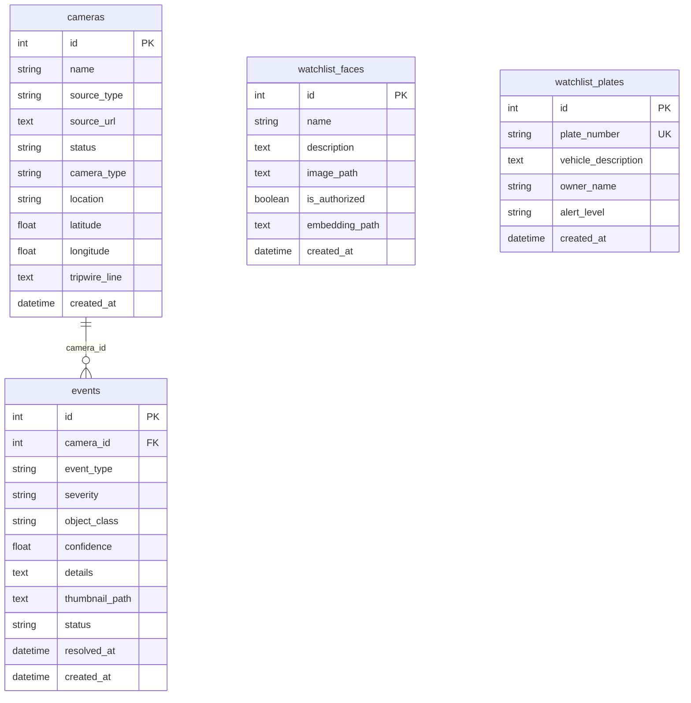

# DRISHTI — Backend & API Documentation

## Backend Overview

| Property | Value |
|----------|-------|
| **Framework** | FastAPI 0.115.12 |
| **ASGI Server** | Uvicorn 0.34.2 |
| **Database** | SQLite via SQLAlchemy 2.0.41 |
| **Entry Point** | `backend/app/main.py` |
| **Run Command** | `uvicorn app.main:app --host 0.0.0.0 --port 8000 --reload` |
| **Database File** | `backend/ibvap.db` |

---

## Directory Structure

```
backend/
├── app/
│   ├── __init__.py
│   ├── main.py                    # FastAPI app, lifespan, alert_dispatcher
│   ├── api/
│   │   ├── __init__.py
│   │   ├── cameras.py             # Camera CRUD, demo mode, phone registration
│   │   ├── events.py              # Event queries, stats, evidence, blockchain
│   │   ├── reports.py             # PDF report generation (ReportLab)
│   │   ├── settings.py            # Settings read/write
│   │   ├── system.py              # System status, threat score, LAN URL, QR
│   │   └── watchlist.py           # Face and plate watchlist management
│   ├── core/
│   │   ├── __init__.py
│   │   ├── config.py              # Environment, paths, constants
│   │   ├── database.py            # SQLAlchemy models, engine, session
│   │   ├── settings_manager.py    # JSON settings with defaults
│   │   └── system_monitor.py      # CPU/memory/FPS monitoring (psutil)
│   ├── services/
│   │   ├── __init__.py
│   │   ├── blockchain.py          # SHA-256 proof-of-work chain
│   │   ├── ml_inference.py        # YOLO + tracking + tripwire + behavior
│   │   ├── recognition.py         # DeepFace + EasyOCR
│   │   ├── threat_score.py        # Rolling 0-100 threat meter
│   │   ├── video_ingestion.py     # VideoStream, PushStream, StreamManager
│   │   ├── detectors/
│   │   │   ├── __init__.py        # Registers fight, fire, crash
│   │   │   ├── base.py            # Detector ABC, registry, DetectorContext
│   │   │   ├── crash.py           # Vehicle crash heuristic
│   │   │   ├── fight.py           # Fight detection heuristic
│   │   │   └── fire.py            # Fire/smoke detection
│   │   └── notify/
│   │       ├── __init__.py        # Registers null, email
│   │       ├── dispatcher.py      # Channel ABC, registry, fan-out
│   │       ├── email.py           # SMTP email with HTML + CID evidence
│   │       └── null.py            # Log-only channel
│   └── ws/
│       ├── __init__.py
│       └── video_stream.py        # WebSocket: frame stream, alerts, push
├── bytetrack_custom.yaml          # ByteTrack tracker configuration
├── requirements.txt               # Python dependencies
├── yolov8n.pt                     # YOLOv8 Nano weights (6.5 MB)
├── yolov8s.pt                     # YOLOv8 Small weights (22.6 MB)
├── ibvap.db                       # SQLite database (runtime)
├── data/
│   ├── settings.json              # Persisted runtime settings
│   ├── blockchain/
│   │   └── ledger.json            # Blockchain ledger
│   ├── evidence/                  # Captured evidence JPEGs
│   └── reports/                   # Generated PDF reports
├── demo_videos/                   # Canned demo clips
│   └── README.md
├── eval/                          # Evaluation framework
│   ├── evaluate.py
│   ├── features.py
│   ├── manifest.json
│   ├── manifest.py
│   ├── runner.py
│   ├── settings_source.py
│   └── results/
└── venv/                          # Python virtual environment
```

---

## Database Schema

### Tables



### Field Details

#### `cameras`
| Field | Type | Description |
|-------|------|-------------|
| `source_type` | `string(20)` | `"file"`, `"rtsp"`, or `"phone"` |
| `status` | `string(20)` | `"active"`, `"inactive"`, `"error"` |
| `camera_type` | `string(20)` | `"fixed"` or `"ptz"` (default: `"fixed"`) |
| `tripwire_line` | `text` | JSON string of line coordinates: `[[{x, y}, {x, y}], ...]` |

#### `events`
| Field | Type | Description |
|-------|------|-------------|
| `event_type` | `string(50)` | `"intrusion"`, `"dwelling"`, `"behavioral"`, `"fight"`, `"fire"`, `"smoke"`, `"crash"`, `"watchlist_match"` |
| `severity` | `string(20)` | `"info"`, `"warning"`, `"high"`, `"critical"` |
| `status` | `string(20)` | `"new"`, `"acknowledged"`, `"resolved"`, `"archived"` |
| `details` | `text` | JSON: `{"title": "...", "detail": "...", "id": "..."}` |
| `thumbnail_path` | `text` | URL path like `/evidence/evt_123.jpg` |

#### `watchlist_faces`
| Field | Type | Description |
|-------|------|-------------|
| `is_authorized` | `boolean` | If true, suppresses dwelling/intrusion alerts for this person |
| `image_path` | `text` | Absolute path to the face image in `data/faces/` |

---

## Complete API Reference

### Camera Endpoints

#### `GET /api/cameras/`
List all cameras with stream status.

**Response**: Array of:
```json
{
  "id": 1,
  "name": "Front Gate",
  "source_type": "rtsp",
  "source_url": "rtsp://...",
  "location": "Main Entrance",
  "latitude": 28.6139,
  "longitude": 77.209,
  "tripwire_line": "[[{\"x\":0.1,\"y\":0.5},{\"x\":0.9,\"y\":0.5}]]",
  "status": "active",
  "fps": 14.8,
  "created_at": "2026-09-10T08:30:00"
}
```

#### `POST /api/cameras/`
Add a new camera. Accepts `multipart/form-data`.

| Field | Type | Required | Description |
|-------|------|----------|-------------|
| `name` | string | Yes | Camera display name |
| `source_type` | string | Yes | `"file"`, `"rtsp"`, or `"phone"` |
| `location` | string | No | Descriptive location |
| `source_url` | string | For RTSP | RTSP URL |
| `video_file` | file | For file | Uploaded video |

#### `POST /api/cameras/{camera_id}/start`
Start streaming from a camera. Starts the capture thread, inference thread, and (for phone cameras) the push stream.

#### `POST /api/cameras/{camera_id}/stop`
Stop streaming. Joins threads, releases cv2.VideoCapture.

#### `DELETE /api/cameras/{camera_id}`
Delete camera, stop its stream, and (for uploaded files) delete the video file. Demo clips are preserved.

#### `PATCH /api/cameras/{camera_id}/tripwire`
Set tripwire coordinates.

**Body**: `{"tripwire_line": "[[{\"x\":0.1,\"y\":0.5},{\"x\":0.9,\"y\":0.5}]]"}`

#### `GET /api/cameras/demo/list`
List canned demo video clips in `backend/demo_videos/`.

#### `POST /api/cameras/demo/{filename}/launch`
Register (if needed) and start a camera for a demo clip. Idempotent.

#### `POST /api/cameras/phone/register`
Create a phone-source camera and open it for pushed frames.

#### `GET /api/cameras/streams/status`
Get status of all active video streams.

---

### Event Endpoints

#### `GET /api/events/`
Query events with optional filters.

| Parameter | Type | Description |
|-----------|------|-------------|
| `skip` | int | Pagination offset (default 0) |
| `limit` | int | Page size (default 100) |
| `camera_id` | int | Filter by camera |
| `severity` | string | Filter by severity |
| `status` | string | Filter by status |

#### `PATCH /api/events/{event_id}/status`
Update event status. Query param: `status` (new, acknowledged, resolved, archived).

#### `GET /api/events/stats`
Returns: `{timeline: [...], severity: [...], cameras: [...]}`

#### `GET /api/events/heatmap`
Returns camera locations with event counts for geospatial visualization.

#### `GET /api/events/{event_id}/evidence/download`
Download the raw JPEG evidence frame as an attachment.

#### `GET /api/events/{event_id}/blockchain`
Get blockchain verification status for an event.

**Response (verified)**:
```json
{
  "status": "verified",
  "block": {
    "index": 42,
    "timestamp": 1694358000.0,
    "event_id": 15,
    "evidence_hash": "a3f2...",
    "event_hash": "b4e1...",
    "previous_hash": "c5d0...",
    "nonce": 1234,
    "hash": "000abc..."
  }
}
```

---

### Report Endpoints

#### `GET /api/reports/{event_id}/download`
Generate and download a PDF incident report. Runs `generate_pdf_sync()` in a thread pool.

PDF contains:
- Title: "DRISHTI - SECURITY INCIDENT REPORT"
- Metadata table (incident ID, datetime, severity, event type, camera, location, track ID)
- AI detection summary
- Legal disclaimer about alert triggering rules
- Evidence snapshot (embedded image)
- Blockchain verification table (block hash, evidence SHA-256, previous hash)
- QR code linking to block hash for verification

---

### Settings Endpoints

#### `GET /api/settings/`
Returns the merged settings (defaults + persisted overrides from `data/settings.json`).

#### `PATCH /api/settings/`
Merge-patches the settings store. Body: JSON dict of keys to update.

---

### System Endpoints

#### `GET /api/system/status`
Returns system resource stats from `SystemMonitor`:
```json
{
  "cpu_usage": 45.2,
  "memory_usage": 62.1,
  "source_fps": 15.0,
  "rendered_fps": 14.8,
  "inference_fps": 8.3,
  "inference_latency_ms": 120.5,
  "processing_latency_ms": 170.0,
  "services": {
    "yolo": "active",
    "tracker": "active",
    "face_recognition": "idle",
    "alpr": "idle",
    "tripwire": "active",
    "night_mode": "disabled"
  }
}
```

#### `GET /api/system/threat`
Rolling threat score with decay, band classification, trend, and top contributors.

#### `GET /api/system/lan-url`
Returns the LAN URL a phone should visit to join as a camera.

#### `GET /api/system/qr`
Generate a PNG QR code for the given `data` query parameter.

---

### Watchlist Endpoints

#### `GET /api/watchlist/faces`
List all faces in the watchlist.

#### `POST /api/watchlist/faces`
Upload a face image. Validates face detection via DeepFace before saving. Deletes the DeepFace representation cache to force rebuild.

#### `DELETE /api/watchlist/faces/{face_id}`
Remove a face, delete the image file, and clear the representation cache.

#### `GET /api/watchlist/plates`
List all license plates in the watchlist.

#### `POST /api/watchlist/plates`
Add a plate number to the watchlist.

#### `DELETE /api/watchlist/plates/{plate_id}`
Remove a plate from the watchlist.

---

### WebSocket Endpoints

#### `WS /ws/camera/{camera_id}`
Streams JPEG frames for a specific camera at ~15 FPS.

**Messages sent** (JSON):
```json
// When stream is active:
{
  "type": "frame",
  "camera_id": 1,
  "frame": "<base64-encoded JPEG>",
  "fps": 14.8,
  "frame_count": 1542
}

// When stream is inactive:
{
  "type": "status",
  "camera_id": 1,
  "status": "inactive",
  "message": "Camera stream not active"
}
```

#### `WS /ws/alerts`
Subscribes to real-time alert notifications. All connected clients receive every alert.

**Messages sent** (JSON):
```json
{
  "id": "inc_1694358000_a3f2b1",
  "camera_id": 1,
  "type": "intrusion",
  "severity": "critical",
  "level": "CRITICAL",
  "title": "Tripwire Intrusion: Person",
  "detail": "A person crossed a virtual perimeter line.",
  "time": "14:30:00",
  "icon": "🚨",
  "db_id": 42,
  "camera_name": "Front Gate",
  "has_evidence": true
}
```

#### `WS /ws/cameras/{camera_id}/push`
Receives JPEG frames pushed from a phone browser. Binary messages only.

**Protocol**:
1. Client connects → server sends `{"type": "ready", "camera_id": N}`
2. Client sends binary JPEG frames
3. Server ACKs every 30 frames: `{"type": "ack", "frames": 30, "fps": 11.5}`
4. Text messages are ignored (keepalive pings)

---

### Health Endpoint

#### `GET /api/health`
```json
{
  "status": "healthy",
  "active_streams": 2,
  "total_streams": 3
}
```

---

## Error Handling

| Scenario | Handling |
|----------|----------|
| Invalid RTSP URL | `cv2.VideoCapture.isOpened()` returns False → error stored on stream, HTTP 500 returned |
| RTSP disconnect | Capture loop logs warning, sleeps 2s, attempts reconnect via `cv2.VideoCapture()` |
| Video file not found | Returns `False` from `start()`, error message set |
| Video file end | Loops by rewinding to frame 0 (`CAP_PROP_POS_FRAMES = 0`) |
| YOLO model missing | `ultralytics` ImportError → ML inference disabled, all frames return empty |
| Inference exception | Caught in `process_frame()`, logged with traceback, returns `[], []` |
| Detector exception | Caught in `run_all()`, logged with full traceback, other detectors still run |
| WebSocket disconnect | Client removed from subscriber list |
| Alert broadcast failure | Caught per-client, disconnected clients cleaned up |
| Email send failure | Isolated per-channel, logged, does not affect other channels |
| Notification timeout | `asyncio.wait_for` kills after `notify_timeout` seconds |
| Database session | `finally: db.close()` pattern throughout |

---

## Middleware & Security

### CORS
- Specific origins: `FRONTEND_URL`, `localhost:5173`, `127.0.0.1:5173`
- Regex: any `192.168.x.x`, `10.x.x.x`, `172.16-31.x.x` with any port
- All methods and headers allowed, credentials enabled

### Authentication
**Not implemented.** The README states: "API Authentication (JWT) is stubbed but disabled by default for hackathon demonstration purposes." The `python-jose` and `passlib` packages are in `requirements.txt` but no auth middleware or login endpoints exist in the current codebase.

### Input Validation
- Camera `source_type` validated against `("file", "rtsp", "phone")`
- Event `status` validated against `["new", "acknowledged", "resolved", "archived"]`
- Tripwire data is a JSON string stored as-is
- Pydantic model used for `TripwireUpdate`
- Face upload validated by attempting DeepFace embedding generation

### Static File Serving
- `/evidence` → `data/evidence/` (evidence JPEGs)
- `/data` → project-root `data/` directory (all data files)
